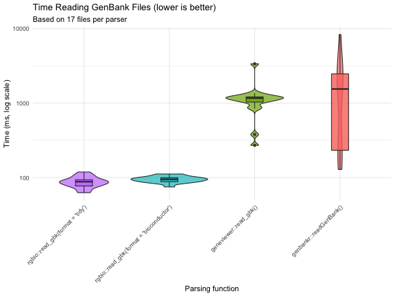

# Benchmarking rgbio Performance

## Benchmark Setup

To evaluate real-world performance, we downloaded 17 archaeal type strain assemblies from the order "Methanococcales" directly from NCBI using the `datasets` command-line tool. These represent real-world GenBank files with varying sizes and complexity.


```
#> The Benchmark was run on 2026-03-06 using rgbio version 0.2.0
```

### Data Download Command
```bash
# Download 17 archaeal type strain assemblies in GenBank format
datasets download genome taxon "methanococcales" \
  --from-type \
  --reference \
  --assembly-source RefSeq \
  --include gbff \
  --filename methanococcales_type_strains.zip --dehydrated && \
  unzip methanococcales_type_strains.zip && \
  datasets rehydrate --directory .
```

## Packages Tested

We compared `rgbio` against three other popular GenBank reading packages:


``` r
library(bench)
library(dplyr)
library(ggplot2)

# Packages being benchmarked
library(rgbio)      # High-performance GenBank I/O using Rust gb-io crate
library(read.gb)    # Specifically made for reading gb files  
library(geneviewer) # Has a function to read gb files
library(genbankr)   # Traditional Bioconductor GenBank reader. Only available up to Bioconductor version: 3.16 ≙ R version 4.2
```

- **rgbio**: Our Rust-powered package with two output formats (`tidy` and `bioconductor`)
- **geneviewer**: A visualization-focused package with GenBank reading capabilities
- **genbankr**: The traditional Bioconductor solution for GenBank parsing
- **read.gb**: A dedicated GenBank file reader

## Running the Benchmarks


``` r
# Set up test data paths
gbk_dir <- "./ncbi_dataset/data"
gbk_files <- list.files(gbk_dir, pattern = "\\.gbff$", recursive = TRUE, full.names = TRUE)

# Define reader functions for consistent testing
readers <- list(
    "rgbio::read_gbk(format = 'tidy')" = function(file) {
        tryCatch({
            rgbio::read_gbk(file, format = "tidy")
        }, error = function(e) {
            message("rgbio (tidy) failed on ", file, ": ", e$message)
            return(NULL)
        })
    },
    "rgbio::read_gbk(format = 'bioconductor')" = function(file) {
        tryCatch({
            rgbio::read_gbk(file, format = "bioconductor")
        }, error = function(e) {
            message("rgbio (bioconductor) failed on ", file, ": ", e$message)
            return(NULL)
        })
    },
    "geneviewer::read_gbk()" = function(file) {
        tryCatch({
            geneviewer::read_gbk(file)
        }, error = function(e) {
            message("geneviewer failed on ", file, ": ", e$message)
            return(NULL)
        })
    },
    "genbankr::readGenBank()" = function(file) {
        tryCatch({
            genbankr::readGenBank(file)
        }, error = function(e) {
            message("genbankr failed on ", file, ": ", e$message)
            return(NULL)
        })
    }
)
```

We use the `bench` package to get accurate timing measurements, testing each parser on every file exactly once to simulate real-world usage patterns.


``` r
# Run comprehensive benchmarks across all file × reader combinations
benchmark_results <- press(
    file = gbk_files,
    reader = names(readers),
    {
        result <- bench::mark(
            result = readers[[reader]](file),
            iterations = 1,
            check = FALSE
        )
    }
)
```

## Processing Results


``` r
# Clean up results and add useful metadata
benchmark_df <- benchmark_results %>%
    mutate(
        file_id = as.numeric(factor(file)),
        file_name = dirname(file),
        file_size_mb = file.info(file)$size / (1024^2),
        success = !is.na(median),
        time_ms = ifelse(success, as.numeric(median) * 1000, NA),
        memory_mb = ifelse(success, as.numeric(gsub("[^0-9.]", "", mem_alloc)), NA)
    ) %>%
    select(reader, file_id, file_name, file_size_mb, success, time_ms, memory_mb)
```


## Results

### Performance Visualization


``` r
p1 <- ggplot(benchmark_df, aes(x = factor(reader, levels = names(readers)), y = time_ms, fill = reader)) +
    geom_violin(alpha = 0.7) + 
    geom_boxplot(width = 0.2, alpha = 0.8) +
    scale_y_log10() + 
    labs(
        title = "Time Reading GenBank Files (lower is better)", 
        y = "Time (ms, log scale)",
        subtitle = paste("Based on", 
                        benchmark_df %>% 
                        filter(success) %>% 
                        group_by(reader) %>% 
                        summarise(n = n()) %>% 
                        pull(n) %>% 
                        min(), 
                        "files per parser")
    ) +
    theme_minimal() +
    theme(
        axis.text.x = element_text(angle = 45, hjust = 1),
        legend.position = "none"
    ) +
    xlab("Parsing function")

p1
```



### Summary Statistics


``` r
# Calculate performance summary with speedup factors
summary_stats <- benchmark_df %>%
    group_by(reader) %>%
    summarise(
        n_files = n(),
        median_time_ms = round(median(time_ms, na.rm = TRUE), 1),
        mean_time_ms = round(mean(time_ms, na.rm = TRUE), 1),
        median_memory_mb = round(median(memory_mb, na.rm = TRUE), 1),
        .groups = "drop"
    ) %>%
    arrange(factor(reader, levels = names(readers))) %>%
    mutate(
        max_time = max(median_time_ms),
        speedup = case_when(
            median_time_ms == max_time ~ "baseline",
            TRUE ~ paste0(round(max_time / median_time_ms, 1), "x")
        )
    ) %>% 
    select(reader, speedup, median_time_ms, mean_time_ms, median_memory_mb, n_files)

knitr::kable(summary_stats, 
             col.names = c("Parser", "Speed vs Slowest", "Median Time (ms)", 
                          "Mean Time (ms)", "Median Memory (MB)", "Files Tested"),
             caption = "Performance comparison summary")
```


Table: Performance comparison summary

|Parser                                   |Speed vs Slowest | Median Time (ms)| Mean Time (ms)| Median Memory (MB)| Files Tested|
|:----------------------------------------|:----------------|----------------:|--------------:|------------------:|------------:|
|rgbio::read_gbk(format = 'tidy')         |17.6x            |             87.8|           87.6|               31.2|           17|
|rgbio::read_gbk(format = 'bioconductor') |16.3x            |             94.6|           94.9|               29.3|           17|
|geneviewer::read_gbk()                   |1.3x             |           1162.6|         1166.3|                1.5|           17|
|genbankr::readGenBank()                  |baseline         |           1545.1|         1774.0|               34.8|           17|


## Key Findings

The benchmarks reveal several important insights:

1. **rgbio is significantly faster**: Both `rgbio` formats substantially outperform traditional R-based parsers
2. **Consistent performance**: `rgbio` shows reliable performance across different file sizes and complexities  
3. **Format flexibility**: The `tidy` format offers the best performance, while `bioconductor` format provides compatibility with existing workflows
4. **Memory efficiency**: `rgbio` maintains competitive memory usage while delivering superior speed

## Technical Details


``` r
sessionInfo()
#> R version 4.2.3 (2023-03-15)
#> Platform: aarch64-apple-darwin20 (64-bit)
#> Running under: macOS 15.7.4
#> 
#> Matrix products: default
#> LAPACK: /Library/Frameworks/R.framework/Versions/4.2-arm64/Resources/lib/libRlapack.dylib
#> 
#> locale:
#> [1] en_US.UTF-8/en_US.UTF-8/en_US.UTF-8/C/en_US.UTF-8/en_US.UTF-8
#> 
#> attached base packages:
#> [1] stats     graphics  grDevices utils     datasets  methods   base     
#> 
#> other attached packages:
#> [1] genbankr_1.26.0   geneviewer_0.1.11 read.gb_2.2       rgbio_0.2.0       ggplot2_4.0.2    
#> [6] dplyr_1.2.0       bench_1.1.4      
#> 
#> loaded via a namespace (and not attached):
#>  [1] MatrixGenerics_1.10.0       Biobase_2.58.0              httr_1.4.8                 
#>  [4] tidyr_1.3.1                 bit64_4.0.5                 jsonlite_2.0.0             
#>  [7] S7_0.2.1                    stats4_4.2.3                BiocFileCache_2.6.1        
#> [10] blob_1.3.0                  profmem_0.7.0               BSgenome_1.66.3            
#> [13] Rsamtools_2.14.0            GenomeInfoDbData_1.2.9      yaml_2.3.12                
#> [16] progress_1.2.3              lattice_0.20-45             pillar_1.11.1              
#> [19] RSQLite_2.3.7               glue_1.8.0                  digest_0.6.39              
#> [22] GenomicRanges_1.50.2        RColorBrewer_1.1-3          XVector_0.38.0             
#> [25] Matrix_1.5-3                htmltools_0.5.9             XML_3.99-0.22              
#> [28] pkgconfig_2.0.3             biomaRt_2.54.1              zlibbioc_1.44.0            
#> [31] purrr_1.0.2                 scales_1.4.0                fontawesome_0.5.3          
#> [34] BiocParallel_1.32.6         tibble_3.3.1                KEGGREST_1.38.0            
#> [37] generics_0.1.4              farver_2.1.2                IRanges_2.32.0             
#> [40] SummarizedExperiment_1.28.0 cachem_1.1.0                withr_3.0.2                
#> [43] GenomicFeatures_1.50.4      BiocGenerics_0.44.0         cli_3.6.5                  
#> [46] magrittr_2.0.4              crayon_1.5.3                memoise_2.0.1              
#> [49] evaluate_1.0.5              xml2_1.3.6                  tools_4.2.3                
#> [52] prettyunits_1.2.0           hms_1.1.4                   matrixStats_1.3.0          
#> [55] BiocIO_1.8.0                lifecycle_1.0.5             stringr_1.6.0              
#> [58] S4Vectors_0.36.2            DelayedArray_0.24.0         AnnotationDbi_1.60.2       
#> [61] Biostrings_2.66.0           compiler_4.2.3              GenomeInfoDb_1.34.9        
#> [64] rlang_1.1.7                 grid_4.2.3                  RCurl_1.98-1.14            
#> [67] rstudioapi_0.18.0           VariantAnnotation_1.44.1    rjson_0.2.21               
#> [70] rappdirs_0.3.4              htmlwidgets_1.6.4           bitops_1.0-7               
#> [73] codetools_0.2-19            restfulr_0.0.15             gtable_0.3.6               
#> [76] rentrez_1.2.4               DBI_1.3.0                   curl_7.0.0                 
#> [79] R6_2.6.1                    GenomicAlignments_1.34.1    knitr_1.51                 
#> [82] rtracklayer_1.58.0          utf8_1.2.6                  fastmap_1.2.0              
#> [85] bit_4.0.5                   filelock_1.0.3              stringi_1.8.4              
#> [88] parallel_4.2.3              vctrs_0.7.1                 png_0.1-8                  
#> [91] dbplyr_2.5.2                tidyselect_1.2.1            xfun_0.56
```

## Conclusion

These benchmarks demonstrate that `rgbio` provides substantial performance improvements for GenBank file parsing in R, making it an excellent choice for both interactive analysis and large-scale genomic data processing workflows. The Rust-powered backend delivers the speed improvements while maintaining the familiar R interface that researchers expect.

For the most up-to-date benchmarks and methodology, visit the [rgbio GitHub repository](https://github.com/richardstoeckl/rgbio).
